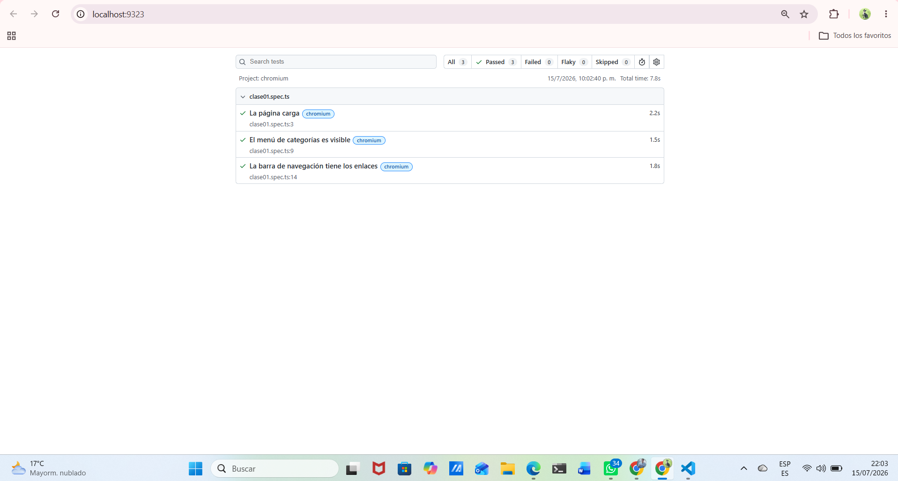

# 🎭 QA Automation con Playwright — Laboratorio 01

> Automatización de pruebas End-to-End sobre [Demoblaze](https://www.demoblaze.com) usando **Playwright + TypeScript**.


---

## 👤 Datos del estudiante

| Campo | Detalle |
|---|---|
| **Nombre** | Amner Alberto Pérez Marroquín |
| **Carné** | 1790-227230 |
| **Laboratorio** | 01 — Primer test con Playwright |
| **Sitio bajo prueba (SUT)** | https://www.demoblaze.com |

---

## 🛠️ Entorno de desarrollo

| Herramienta | Versión |
|---|---|
| **Node.js** | v25.9.0 |
| **npm** | 11.12.1 |
| **Git** | 2.51.0 |
| **Visual Studio Code** | 1.121.0 |
| **Extensión** | Playwright Test for VSCode (`ms-playwright.playwright`) |
| **Sistema operativo** | Windows 11 |

---

## 📁 Estructura del proyecto

```
qa-playwright-curso/
├── docs/
│   └── tests-passing.png       # Evidencia: los 3 tests pasando
├── tests/
│   └── clase01.spec.ts         # Suite de pruebas del laboratorio
├── .gitignore                  # Excluye node_modules, reportes y artefactos
├── .npmrc                      # Seguridad: ignore-scripts=true
├── package.json                # Dependencias del proyecto
├── playwright.config.ts        # Configuración de Playwright
├── tsconfig.json               # Configuración de TypeScript
└── README.md                   # Este archivo
```

---

## ⚙️ Configuración aplicada

### `playwright.config.ts`

| Opción | Valor | Para qué sirve |
|---|---|---|
| `testDir` | `./tests` | Carpeta donde Playwright busca los tests |
| `timeout` | `30000` | Máximo 30 s por test antes de fallar |
| `reporter` | `list` + `html` | Salida en consola y reporte visual navegable |
| `baseURL` | `https://www.demoblaze.com` | Permite navegar con `page.goto('/')` |
| `headless` | `false` | Muestra el navegador durante la ejecución |
| `screenshot` | `only-on-failure` | Captura automática solo si un test falla |
| `video` | `retain-on-failure` | Graba video solo de los tests que fallan |
| `projects` | `chromium` (Desktop Chrome) | Navegador objetivo de la suite |

### `tsconfig.json`

Compilación en **ES2020** con `strict: true` activado, para detectar errores de tipos antes de ejecutar.

---

## 🔒 Nota de seguridad: bloqueo de scripts de instalación

Al correr `npm install`, los paquetes pueden ejecutar scripts automáticos (`postinstall`). Esto es un **vector de ataque de cadena de suministro**: una dependencia comprometida podría ejecutar código en la máquina sin aprobación del desarrollador.

**Protección aplicada** — el archivo `.npmrc` contiene:

```
ignore-scripts=true
```

**Consecuencia intencional:** la descarga de navegadores deja de ser automática y se lanza de forma explícita y consciente:

```bash
npx playwright install
```

---

## 🧪 Aqui muestro los Tests implementados

Archivo: **`tests/clase01.spec.ts`** — 3 verificaciones sobre la carga de la página principal.

### 1️⃣ La página carga
Valida que el sitio responde y renderiza su estructura base.
- El título de la página contiene `STORE` → `expect(page).toHaveTitle(/STORE/)`
- La barra de navegación `#navbarExample` es visible

### 2️⃣ El menú de categorías es visible
Valida que el componente de categorías del sidebar se renderiza.
- El elemento `#cat` es visible

### 3️⃣ La barra de navegación tiene los enlaces
Valida la navegación principal usando un locator con rol semántico.
- Dentro de `#navbarExample` existe y es visible el enlace `Home`

> 💡 Los tres tests usan `page.goto('/')` en lugar de la URL completa, aprovechando el `baseURL` definido en la configuración.

---

## 🚀 Cómo ejecutar el proyecto

### Requisitos previos
- Node.js **v18 o superior**
- Git

### Instalación

```bash
# 1. Clonar el repositorio
git clone https://github.com/PerezAmnerJr/qa-playwright-curso.git
cd qa-playwright-curso

# 2. Instalar dependencias
npm install

# 3. Instalar los navegadores (manual, por ignore-scripts=true)
npx playwright install
```

### Ejecución

```bash
# Ejecutar todos los tests
npx playwright test

# Ver el reporte HTML (se abre en http://localhost:9323)
npx playwright show-report

# Modo visual interactivo (los tests se lanzan con clic)
npx playwright test --ui
```

---

## ✅ Resultados

**3 de 3 tests aprobados** — 0 fallidos, 0 flaky, 0 omitidos.



| Test | Estado | Duración |
|---|---|---|
| La página carga | ✅ Passed | 2.2 s |
| El menú de categorías es visible | ✅ Passed | 1.5 s |
| La barra de navegación tiene los enlaces | ✅ Passed | 1.8 s |
| **Total** | **✅ 3 passed** | **7.8 s** |

---

## 📚 Aprendizajes de la clase

- Configurar un proyecto de Playwright desde cero con TypeScript.
- Usar `baseURL` para escribir tests más limpios y mantenibles.
- Diferenciar `headless: false` (desarrollo, ver el navegador) de `headless: true` (CI/CD).
- Aplicar `ignore-scripts=true` como medida contra ataques de cadena de suministro.
- Localizar elementos por **ID** (`#navbarExample`, `#cat`) y por **rol semántico** (`getByRole('link', { name: 'Home' })`).
- Interpretar el reporte HTML: passed, failed, flaky y tiempos de ejecución.

---

---

# 🧪 Laboratorio 02 — Navegación, esperas y capturas

Archivo: **`tests/clase02.spec.ts`** — 4 tests sobre https://www.demoblaze.com

## Tests implementados

### 1️⃣ Navegar al carrito y regresar al inicio
Navega a la página principal, entra al carrito con `waitForURL` como espera explícita, y regresa con `goBack()`. Genera las evidencias `01-pagina-inicio.png` y `02-carrito-vacio.png`.

### 2️⃣ Navegar a la categoría Phones y ver un producto
Entra a la categoría Phones, espera los productos con `waitForSelector` (en lugar de `waitForResponse`, para no depender de endpoints internos que pueden cambiar), verifica que haya más de 0 productos, abre el primero y comprueba que el botón "Add to cart" sea visible. Genera `03-detalle-producto.png`.

### 3️⃣ Capturar el navbar y el footer por separado
Toma capturas de **elementos específicos** (no de página completa): el navbar (`#navbarExample`) y el footer (`#footc`). Genera `04-navbar.png` y `05-footer.png`.

> **Adecuación realizada:** la versión inicial usaba el selector genérico `.container-fluid).last()`, que coincidía con un elemento oculto de la página y hacía fallar el test por timeout. Se corrigió usando el ID específico del footer (`#footc`), agregando `scrollIntoViewIfNeeded()` para desplazarse hasta él, y reemplazando el `if` opcional por una aserción `expect(...).toBeVisible()`, ya que la captura del footer pasó a ser un requisito obligatorio.

### 4️⃣ Verificar tiempo de carga de la página
Prueba de rendimiento básica: cronometra la carga completa con `Date.now()` y `waitForLoadState('load')`, imprime la métrica con `console.log` y verifica con `toBeLessThan(10000)` que cargue en menos de 10 segundos.

## 📷 Evidencias

La carpeta `evidencias/` se crea automáticamente con un hook `test.beforeAll` y contiene las capturas generadas por los tests:

| Evidencia | Descripción |
|---|---|
| `01-pagina-inicio.png` | Página principal (captura completa) |
| `02-carrito-vacio.png` | Carrito vacío (captura completa) |
| `03-detalle-producto.png` | Detalle de un producto de Phones |
| `04-navbar.png` | Solo el navbar (captura de elemento) |
| `05-footer.png` | Solo el footer (captura de elemento) |

## ✅ Resultados

**4 de 4 tests aprobados** — 0 fallidos, 0 flaky, 0 omitidos.

## 💭 Reflexión: auto-wait vs. sleep()

Los tests automatizados ejecutan instrucciones más rápido de lo que una página web puede cargar, y la velocidad de carga de una página es variable: depende del internet, del servidor y del momento. Ahí nace el problema de las esperas.

`sleep()` (en Playwright, `waitForTimeout`) pausa el test un tiempo fijo, decidido por nosotros los programadores como una adivinanza. Si la página carga más rápido de lo estimado, se desperdicia tiempo en cada corrida; si carga más lento, el test intenta interactuar con elementos que aún no existen y falla sin que haya ningún bug. Como la velocidad de la página cambia entre corridas, el mismo test puede pasar hoy y fallar mañana sin que nadie toque el código: eso es un test *flaky*, y hace que el equipo pierda confianza en la suite de pruebas.

El auto-wait de Playwright resuelve el problema esperando **condiciones** en lugar de tiempo: antes de cada acción verifica automáticamente que el elemento exista, sea visible y esté habilitado, y actúa en el instante en que se cumple. Si la página es rápida, no desperdicia tiempo; si es lenta, espera lo necesario; y si el elemento nunca aparece, falla con razón, señalando un problema real.

En este laboratorio lo aplicamos con esperas explícitas de la misma filosofía: `waitForURL` para esperar el cambio de página al ir al carrito, `waitForSelector` para esperar a que carguen los productos de la categoría Phones, y `waitForLoadState` para medir el tiempo de carga completo. En ningún test usamos tiempos fijos, y por eso la duración de cada corrida varió (por ejemplo, el tiempo de carga midió 1605ms una vez y 1255ms en otra) sin que ningún test fallara: cada uno esperó exactamente lo que la página necesitó.

**Conclusión:** `sleep()` apuesta un tiempo fijo contra algo impredecible, produciendo tests lentos o inestables; el auto-wait espera la condición real, produciendo tests rápidos y confiables a la vez.

---

Laboratorio 03 — Locators que doy a conocer 

Archivo: tests/clase03.spec.ts — 6 tests de clase mas 3 tests reto (9 tests en total, todos pasando).

Tests de clase

Aplican los distintos tipos de locators de Playwright: por texto (getByText), por CSS (clases), por ID, por rol (getByRole), por atributo (getAttribute), encadenados (locator dentro de locator) y negacion (not.toBeVisible).

Tests reto

Reto 1: Locator por rol. Verifica el boton "Place Order" del carrito con getByRole('button').

Reto 2: Locator con filter. Encuentra un producto especifico entre varios con filter hasText y lee su precio.

Reto 3: Locator por atributo parcial. Verifica las categorias del sidebar mediante el selector onclick que contiene "byCat".

Nota sobre el Reto 3: las 3 categorias podian localizarse por id, pero elegi el atributo onclick porque las tres comparten onclick="byCat(...)". Es mas semantico: identifica la accion de la categoria en lugar de un id de maquetacion.

Caso de prueba

casos-de-prueba/TC-001.md — Agregar un producto al carrito (Sony vaio i5). Documento formal con objetivo, precondiciones, datos de prueba, pasos y resultado esperado.

Ejecucion

Ejecutar los tests: npx playwright test clase03.spec.ts
Ver el reporte: npx playwright show-report

Resultado: 9 tests aprobados.
s

